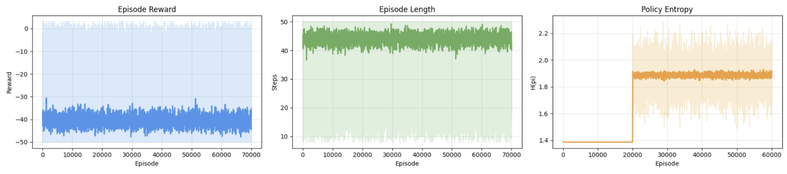
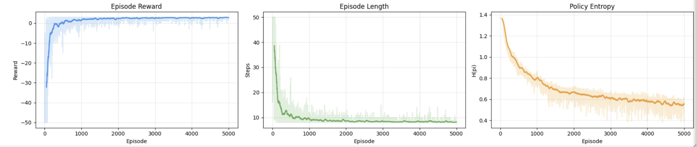

[← back](../index.html){.back}

# Policy gradient on GridWorld  

::: {.date}
March 27, 2026
:::

In this experiment, we play around with a very simple algorithm on a very simple environment. This is a good starting point for RL research: train a neural net with the policy gradient method, experimenting with different experimental setups, such as varying the size of the model, training episode length, and the size of the environment/grid. 

## Base: 1 layer, random policy 

- 5000 episodes 
- 1 layer MLP 
- GridWorld size: 10
- Training algorithm: none (random) 

    

## Base: 1 layer, trained policy 

- 5000 episodes 
- 1 layer MLP 
- GridWorld size: 10
- Training algorithm: REINFORCE with policy gradient

    
