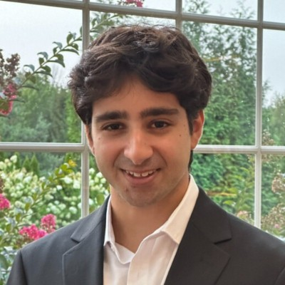

::: {.header}

::: {.header-text}
# 🦜 Rohan Sikand

::: {.subtitle}
Stanford CS (AI) B.S., M.S. (2026)
:::
:::

:::

::: {.nav}
[**Research & Projects**](#research) [**Blog**](#blog) [<i class="bi bi-twitter-x"></i>](https://x.com/rosikand){.icon-link} [<i class="bi bi-linkedin"></i>](https://www.linkedin.com/in/rosikand/){.icon-link} [<i class="bi bi-github"></i>](https://github.com/rosikand){.icon-link} [<i class="bi bi-mortarboard-fill"></i>](https://scholar.google.com/citations?user=E5Z8wUoAAAAJ){.icon-link} [<i class="bi bi-envelope-fill"></i>](mailto:rsikand@stanford.edu){.icon-link}
:::

{.profile-pic}

> <u>**Note**</u>: I am on the job market! I am looking for research or engineering positions in machine learning. Please feel free to reach out!

I am interested in **AI research, ML engineering, startups, and venture capital**.

In the past, I’ve conducted research in **self-supervised learning** at SAIL, engineered segmentation models at **insitro**, and built many ML projects.

I am currently interested in **RL and reasoning** for post-training foundation models and also video models and VLA’s for **robot learning**. See my [research notebook](https://rosikand.github.io/research-notebook/) for more.

I also infrequently write about startups and venture capital on **Substack** at [**Rohan’s Random Walks**](https://rosikand.substack.com/).

In my free time, I play golf and tennis.

Feel free to reach out!

## Research and Projects {#research}

::: {.project}
{.project-img}

::: {.project-text}
### [Project Title](projects/project-one.html)
One-line description. `Venue 2025`
[[paper]](#) [[code]](#)
:::
:::

::: {.project}
{.project-img}

::: {.project-text}
### [Project Title](projects/project-two.html)
One-line description. `Venue 2025`
[[paper]](#) [[code]](#)
:::
:::

::: {.project}
{.project-img}

::: {.project-text}
### [Project Title](projects/project-three.html)
One-line description. `Preprint`
[[paper]](#) [[code]](#)
:::
:::

## Blog {#blog}

- [Model training experience](blog/model-training.html) — *March 26 2026*
- [Questions in robot learning](blog/robotics-questions.html) — *March 25 2026*
<!-- - [The Ingredients required to Start a Startup](blog/startup-ingrediants.html) — *March 24, 2026* -->
- [Problems and Ideas, c. Fall 2024](blog/problems-fall-2024.html) — *November 25, 2024*
- [The Next Frontiers: Personalization of AI models](blog/personal-ai.html) — *September 15, 2024*
- [A simple functorch example](blog/functorch.html) — *November 05, 2022*